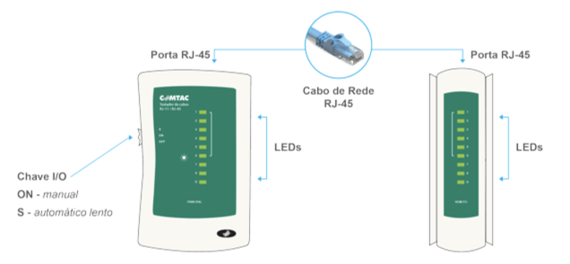

## 1- Crimpar um conector RJ-45

É um processo importante para criar cabos de rede Ethernet. A crimpagem envolve a fixação dos fios dentro do conector de forma que eles estejam devidamente alinhados e conectados aos pinos internos.

**Materiais Necessários:**

 * Cabo de rede (geralmente U/FTP, U/UTP, FTP ou STP, com 4 pares de fios)
 * Conectores RJ-45
 * Ferramenta de decapagem de cabos ou um estilete
 * Ferramenta de corte
 * Diagrama de pinagem (para garantir que os fios estejam na ordem correta)
 * Alicate para crimpagem de conectores RJ45

**Ferramentas necessárias**

* **Alicate de crimpar Multi função:** Corta fio para conectores de passagem EZ Crimp RJ45 RJ12 RJ11
<table border="0">
<tbody>
<tr>
<td style="width: 40%;"></td>
</tr>
<tr>
<td style="text-align: center;">Figura 8 - Alicate para crimpagem de conectores RJ45.</td>
</tr>
</tbody>
</table>
 
* **O RJ45:** O Registered Jack 45 é um dos principais conectores utilizado para ligar placas de rede Ethernet a ativos como switchs, roteadores, etc.
<table border="0">
<tbody>
<tr>
<td style="width: 40%;"></td>
</tr>
<tr>
<td style="text-align: center;">Figura 9 - Conectores RJ45.</td>
</tr>
</tbody>
</table>

* **Cabo de rede cat5e:** Foi desenvolvido para suportar velocidades de até 1.000 Mbps, reduzir a interferência da infraestrutura e minimizar a perda de sinal.
Essas melhorias possibilitaram o uso de cabos mais longos, quase próximos dos atuais 100 metros permitidos. Por isso, é indicado para instalações domésticas e corporativas.

* **Cabos metálicos utilizados para rede de dados**

Nos cabos metálicos de par trançado, há algumas classificações importantes: 

* **U/UTP (Unshielded Twisted Pair):** Cabo Par Trançado Não Blindado.Cabos sem blindagem geralmente são mais flexíveis e fáceis de crimpar. Por esse motivo, são mais em conta e populares no mercado. entretanto existem outros conforme a blindagem.
* **FTP (Foiled Twisted Pair):** São cabos os que utilizam uma blindagem mais simples: de fina folha de aço ou de liga de alumínio, elementos que envolvem todos os pares do cabo, protegendo-os contra interferências externas.
* **STP (Shielded Twisted Pair):** Este cabo de rede utiliza uma blindagem individual para cada par de cabos. Isso reduz o crosstalk e melhora a tolerância do cabo de rede com relação à distância, o que pode ser usado em situações em que for necessário crimpar cabos fora do padrão, com mais de 100 metros.
* **SFTP (Screened Foiled Twisted Pair):** Os cabos desse tipo combinam a blindagem individual para cada par de cabos com uma segunda blindagem externa, que envolve todas as tranças, o que os torna especialmente resistentes a interferências externas. Por isso, cabos SFTP são mais adequados a ambientes com grande incidência de distorção.

Geralmente os cabos são compostos por condutores de cobre puro recozido de 0,55mm (24 AWG) de diâmetro nominal, isolados com polietileno sólido. No núcleo, uma capa de PVC, com o intuito de retardar a propagação de chamas em caso de incêndios, é aplicada por meio do processo de extrusão para garantir a segurança necessária em qualquer projeto.

<table border="0">
<tbody>
<tr>
<td style="width: 30%;"></td>
</tr>
<tr>
<td style="text-align: center;">Figura 10 - Cabo UTP - Par trançado não blindado.</td>
</tr>
</tbody>
</table>

**Sequência de Passos**

   * **Preparação dos Fios:**
        Decape cerca de 2-3 cm da capa externa do cabo usando uma ferramenta de decapagem ou um estilete. Certifique-se de não danificar os fios internos.
        Organize os pares de fios na ordem correta. A ordem geralmente é T568B ou T568A, dependendo da configuração da rede. Certifique-se de usar a mesma ordem nos dois lados do cabo (conector RJ-45).
   * **Corte os Fios Excedentes (Opcional):**
        Se os fios internos estiverem muito compridos, você pode cortar o excesso com uma ferramenta de corte para que fiquem aproximadamente alinhados com a parte traseira do conector RJ-45.
   * **Inserção dos Fios no Conector:**
       Insira os fios na ordem correta nos pinos do conector RJ-45. Certifique-se de que os fios estejam bem encaixados nos pinos.
   * **Crimpagem:**
        Insira o conector RJ-45 com os fios no alicate de crimpagem RJ-45. Aperte o alicate com firmeza e certifique-se de que ele esteja completamente fechado. Isso fará com que os contatos metálicos no conector pressionem os fios com força, criando uma conexão sólida.
   * **Verificação:**
        Após a crimpagem, verifique visualmente se os fios estão corretamente alinhados e conectados aos pinos. Use um verificador de cabo ou um testador de cabo para verificar se a conexão está funcionando corretamente. Isso é especialmente importante para garantir que não haja fios cruzados ou mal conectados.
   * **Repetição do Processo:**
        Repita o mesmo processo no outro lado do cabo, garantindo que a ordem dos fios seja a mesma que você usou no primeiro conector RJ-45.

Lembrando que a ordem dos fios (T568B ou T568A) deve ser consistente em ambos os conectores RJ-45 para que o cabo funcione corretamente em sua rede Ethernet. Além disso, use cabos de boa qualidade e certifique-se de que as ferramentas estejam em boas condições para obter resultados confiáveis.

<table border="0">
<tbody>
<tr>
<td style="width: 50%;"></td>
</tr>
<tr>
<td style="text-align: center;">Figura 11 - Ordem dos fios padrão T568B no conector RJ-45.</td>
</tr>
</tbody>
</table>

Dois padrões de T568A e T568B podem ser usados ​​para conectar cabos Ethernet Cat5e e Cat6. A única diferença entre o T568A e o T568B é que as posições dos fios da faixa verde / verde e laranja / laranja são trocadas.

<table border="0">
<tbody>
<tr>
<td style="width: 50%;"></td>
</tr>
<tr>
<td style="text-align: center;">Figura 12 - Ordem dos fios padrão T568B e T568A .</td>
</tr>
</tbody>
</table>

## 2- Testar o funcionamento dos cabos/conectores RJ-45

O testador eletrônico de cabeamento de redes de computador e telefonia é uma ferramenta de medição que visa o bom funcionamento do cabo de acordo com as especificações técnicas em rede de computadores e redes telefônicas. Para executar o teste, conecte os cabos no testador principal e no testador remoto. Ligue a chave de alimentação. As luzes dos dois testadores ligam indicando quais circuitos estão ativos.

<table border="0">
<tbody>
<tr>
<td style="width: 60%;"></td>
</tr>
<tr>
<td style="text-align: center;">Figura 13 - Testador de Cabos RJ-45 / RJ-11.</td>
</tr>
</tbody>
</table>

