<td style="width: 20%;"></td>

**Departamento de Engenharia Elétrica do CEFET-MG Campus NG**

**Coordenação do Curso Técnico de Eletrotécnica**

**Laboratório de Instalações Elétricas Prediais - PLIEP**

**Aula Prática:** Montagem e configuração de uma rede local com telefonesIP,Softfone em celulares e um PBX IP utilizando software de código livre e gratuito.

# Objetivos da aula prática

1. Capacitar os alunos a desenvolver habilidades práticas na montagem de cabos UTP-CAT5 com conectores RJ-45 para estabelecer a rede Ethernet, viabilizando a interligação de equipamentos;
1. Proporcionar conhecimentos para a configuração de telefones IP e softphones para celular, permitindo que os alunos adquiram competências valiosas no campo das comunicações VoIP (Voz sobre IP);
1. Conhecer o básico da operação e das facilidades o SW livre Asterisk e a interface gráfica do PbxIP Issabel.

# Parte teórica
 
**O que é um sistema de telefonia PBX IP?**

A Telefonia IP ou VoIP (Voz sobre IP) é uma tecnologia que permite realizar chamadas telefônicas sobre uma rede de dados IP como se estivesse utilizando a rede STFC (Sistema de Telefonia Fixa Comutada). Esta tecnologia vem se firmando como a que mais faz convergência devido às novas funções trazidas das redes de dados para a rede de telefonia.

O sucesso da implantação da telefonia IP ocorre na maioria dos casos devido ao baixo preço pago nos serviços de ligação de longa distância e por causa das novas funcionalidades para a telefonia, aumentando a produtividade dos funcionários, além de permitir a convergência de serviços de dados, voz, fax e vídeo numa única rede IP. Aplicativos como Whatsapp, Telegram entre outros utilizam esta tecnologia.

O PBX, ou "Private Branch Exchange", é um sistema de telecomunicações usado em empresas para facilitar a comunicação interna e externa. Tradicionalmente, as empresas empregavam telefones proprietários específicos para se conectar ao PBX, mas a evolução tecnológica levou à adoção predominante de sistemas IP-PBX, baseados em padrões abertos e compatíveis com a tecnologia de Voz sobre IP (VoIP).
<table border="0">
<tbody>
<tr>
<td style="width: 50%;">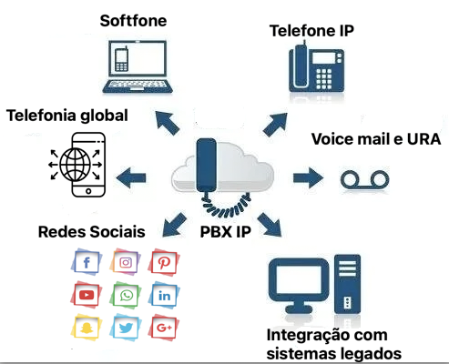</td>
</tr>
<tr>
<td style="text-align: center;">Figura 1 - PBXIP - Aplicações e usos</td>
</tr>
</tbody>
</table>

Os sistemas PBX, são projetados para automatizar e simplificar o gerenciamento de chamadas telefônicas em ambientes corporativos. Isso inclui recursos como grupos de ramais para direcionar chamadas para vários telefones, filas para atendimento ordenando as chamadas, correio de voz para armazenar mensagens, gravações de ligações e muito mais.

PBXIP utiliza a automação e a tecnologia IP para otimizar a gestão das chamadas telefônicas em empresas, oferecendo recursos avançados para melhorar a eficiência nas comunicações internas e externas.

**O que é VOIP?**

<table border="0">
<tbody>
<tr>
<td style="width: 50%;"></td>
</tr>
<tr>
<td style="text-align: center;">Figura 2 - VOIP-"Voz sobre Protocolo de Internet".</td>
</tr>
</tbody>
</table>

VoIP é a sigla para "Voz sobre Protocolo de Internet" (Voice over Internet Protocol, em inglês). Trata-se de uma tecnologia que permite a transmissão de voz e outros tipos de comunicação de áudio e vídeo pela Internet, em vez de usar circuitos telefônicos tradicionais. Em outras palavras, o VoIP permite fazer chamadas telefônicas e conduzir videoconferências usando a infraestrutura de rede da Internet.

A principal vantagem do VoIP é a economia de custos em comparação com as chamadas telefônicas tradicionais, pois utiliza a infraestrutura de Internet já existente. Além disso, o VoIP oferece recursos avançados, como encaminhamento de chamadas, correio de voz, conferências e a capacidade de integrar facilmente a comunicação com outros aplicativos e serviços online.

Para usar o VoIP, você precisa de um serviço VoIP, o WhatsApp por exemplo ou um dispositivo compatível, como um computador, smartphone, tablet ou telefone IP. A voz é convertida em pacotes de dados digitais e transmitida pela Internet para o destinatário, onde é convertida de volta em áudio. Essa tecnologia tornou-se amplamente popular para chamadas de longa distância, videoconferências, chamadas internacionais e comunicações pessoais ou empresariais devido à sua eficiência e custos reduzidos.

**O Asterisk**

[https://github.com/asterisk/asterisk]()

<table border="0">
<tbody>
<tr>
<td style="width: 20%;"></td>
</tr>
<tr>
<td style="text-align: center;">Figura 3 - Software de PBX IP ASTERISK.</td>
</tr>
</tbody>
</table>

O Asterisk é um software de código aberto que desempenha um papel fundamental na implementação de sistemas de telecomunicações baseados em VoIP (Voz sobre Protocolo de Internet) e comunicações unificadas. Ele foi originalmente desenvolvido por Mark Spencer e lançado em 1999 como um projeto de código aberto. Desde então, tornou-se uma das plataformas mais populares e versáteis para a construção de sistemas de PBX e mensagens unificadas.

**Caracteristicas básicas do Asterisk:**

* **Plataforma de Comunicações Aberta:** O Asterisk é altamente flexível e personalizável, o que o torna adequado para uma ampla variedade de aplicações de telecomunicações. Ele pode ser usado para criar sistemas PBX (Private Branch Exchange), gateways VoIP, sistemas de conferência, correio de voz, IVR (Interactive Voice Response), entre outros.

* **Suporte a Protocolos:** O Asterisk suporta uma variedade de protocolos de comunicação, incluindo SIP (Session Initiation Protocol), H.323, IAX (Inter-Asterisk eXchange), PSTN (Rede Telefônica Pública Comutada), e muitos outros. Isso permite a interoperabilidade com uma ampla gama de dispositivos e serviços de comunicação.

* **Recursos Avançados:** Além de funções telefônicas básicas, o Asterisk oferece recursos avançados, como roteamento de chamadas, gravação de chamadas, encaminhamento de chamadas, videoconferência, detecção de fax, autenticação de chamadas, entre outros.

* **Comunidade Ativa:** O Asterisk é mantido por uma comunidade de desenvolvedores ativos e tem uma grande base de usuários em todo o mundo. Isso significa que há suporte contínuo, atualizações regulares e uma variedade de módulos e extensões disponíveis.

* **Comunicações Unificadas:** O Asterisk também pode ser integrado a outras soluções de comunicação, como e-mail, mensagens instantâneas e calendários, para criar sistemas de comunicações unificadas que consolidam diferentes canais de comunicação em uma única plataforma.

O Asterisk é amplamente utilizado por empresas de todos os tamanhos para implementar sistemas de telecomunicações personalizados e eficientes. Sua versatilidade, juntamente com sua natureza de código aberto, o torna uma escolha popular para muitos projetos de comunicação empresarial e VoIP.

**O ISSABEL**

[https://github.com/IssabelFoundation]()

<table border="0">
<tbody>
<tr>
<td style="width: 30%;">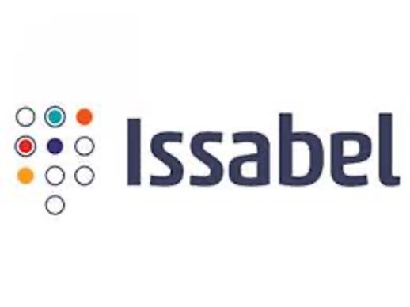</td>
</tr>
<tr>
<td style="text-align: center;">Figura 4 - Plataforma de Comunicação Issabel.</td>
</tr>
</tbody>
</table>

Issabel é uma plataforma de comunicações de voz e dados, de código aberto, baseada no software Asterisk. Ela fornece um conjunto abrangente de recursos para usuários que desejam implementar sistemas de telecomunicações avançados, como PBX (Private Branch Exchange), serviços de telefonia IP (VoIP) e comunicações unificadas. Issabel é conhecido por ser uma distribuição do Asterisk que facilita a configuração e a gestão de sistemas de comunicação.

**Características básicas do Issabel:**

 * **Baseado no Asterisk:** Issabel usa o Asterisk como núcleo de comunicação. Ele inclui todas as capacidades do Asterisk, permitindo que as empresas configurem uma ampla gama de serviços de telefonia e comunicações.

 * **Interface de Gerenciamento:** Uma das características fundamentais do Issabel é sua interface de gerenciamento web amigável e de fácil utilização. Isso torna a configuração e a manutenção do sistema mais acessíveis para administradores de TI e usuários.
 
 * **Recursos Avançados:** O Issabel oferece recursos avançados, como roteamento de chamadas, correio de voz, videoconferência, IVR (Interactive Voice Response), relatórios detalhados, autenticação de chamadas e muito mais. Isso o torna uma solução completa para as necessidades de comunicação de uma empresa.

 * **Comunicações Unificadas:** Além das funcionalidades telefônicas tradicionais, o Issabel pode ser integrado a outras ferramentas de comunicação, como e-mail e mensagens instantâneas, para criar sistemas de comunicações unificadas que consolidam diferentes formas de comunicação.
 
 * **Código Aberto:** Assim como o Asterisk, o Issabel é uma solução de código aberto, o que significa que é possível personalizá-lo e adaptá-lo às necessidades específicas da empresa. Isso também contribui para a economia de custos, pois não requer a compra de licenças de software.

<table border="0">
<tbody>
<tr>
<td style="width: 60%;"></td>
</tr>
<tr>
<td style="text-align: center;">Figura 5 - Dashboard do Issabel.</td>
</tr>
</tbody>
</table>

O Issabel é uma escolha popular para empresas que desejam implementar sistemas de comunicações avançados, especialmente aquelas que procuram uma solução baseada em Asterisk com uma interface de gerenciamento amigável. Ele oferece um conjunto de recursos abrangente e pode ser personalizado de acordo com as necessidades específicas de cada organização.

**PBXIP Issabel está instalado em um servidor Linux no IP 10.240.240.10. Este IP somente é acessível através da rede do Laboratório de Instalações Prediais ou pelo WI-FI DEE-Prediais**
 
## Infraestrutura de hardware do laboratório

O laboratório, fisicamente localizado na sala 203 do prédio 19 campus NG, possui os segintes equipamentos destinados a esta atividade:

* 01 servidor intel, com 4Gb de menória e 1 TB de disco rígido onde está instalado o sistema operacional Linux e a plataforma de sw Issabel;
* 05 telefones IP marca  Khomp IP300;
* 01 switch de 8 portas RJ45 de 10/100/1000 mbps;
* 01 monitor de vídeo 14";
* 01 teclado;
* cabos UTP cat 5;
* conectores RJ45;
* testador de cabos UTP;
* alicate  para crimpagem de conextores RJ45, RJ11 e
* roteador MIKROTIK RB 951UI e WIFE  DEE-Prediais

<table border="0">
<tbody>
<tr>
<td style="width: 50%;"></td>
</tr>
<tr>
<td style="text-align: center;">Figura 6 - Equipamentos utilizados na Prática de PBXIP .</td>
</tr>
</tbody>
</table>

<table border="0">
<tbody>
<tr>
<td style="width: 40%;">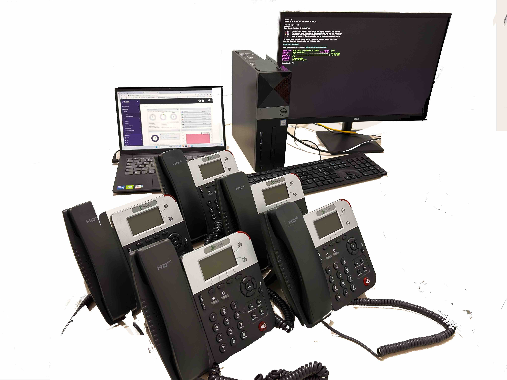</td>
</tr>
<tr>
<td style="text-align: center;">Figura 7 - Foto dos equipamentos  utilizados na Prática de PBXIP.</td>
</tr>
</tbody>
</table>

**Rede Local do Laboratório de Instalações Elétricas Prediais - LIEP**

O Laboratório possui uma LAN e um Wi-Fi isolados da rede do CEFETMG por um firewall. Esta rede destina-se apenas à conexâo de equipamentos internos do laboratorio tais como DVR para CFTV, PBXIP e telefores IP para aulas práticas, etc. Utiliza-se as seguinte configurações de rede:

**Rede DHCP** 

 `IP: 10.240.240.x onde x varia de 20 a 240`
 
 `Gateway :10.240.240.1`
 
 `Máscara: 255.255.255.0`

**O Wi-Fi do Laboratório**

 `SSID       : DEE-Prediais`
 
 `Password   : prediais123`

**Esta rede não possui conexão com a Internet**

# Parte Prática

## 1- Crimpar um conector RJ-45

É um processo importante para criar cabos de rede Ethernet. A crimpagem envolve a fixação dos fios dentro do conector de forma que eles estejam devidamente alinhados e conectados aos pinos internos.

**Materiais Necessários:**

 * Cabo de rede (geralmente U/FTP, U/UTP, FTP ou STP, com 4 pares de fios)
 * Conectores RJ-45
 * Ferramenta de decapagem de cabos ou um estilete
 * Ferramenta de corte
 * Diagrama de pinagem (para garantir que os fios estejam na ordem correta)
 * Alicate para crimpagem de conectores RJ45

**Ferramentas necessárias**

* **Alicate de crimpar Multi função:** Corta fio para conectores de passagem EZ Crimp RJ45 RJ12 RJ11
<table border="0">
<tbody>
<tr>
<td style="width: 40%;"></td>
</tr>
<tr>
<td style="text-align: center;">Figura 8 - Alicate para crimpagem de conectores RJ45.</td>
</tr>
</tbody>
</table>
 
* **O RJ45:** O Registered Jack 45 é um dos principais conectores utilizado para ligar placas de rede Ethernet a ativos como switchs, roteadores, etc.
<table border="0">
<tbody>
<tr>
<td style="width: 40%;">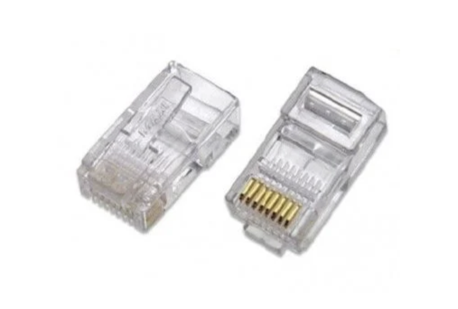</td>
</tr>
<tr>
<td style="text-align: center;">Figura 9 - Conectores RJ45.</td>
</tr>
</tbody>
</table>

* **Cabo de rede cat5e:** Foi desenvolvido para suportar velocidades de até 1.000 Mbps, reduzir a interferência da infraestrutura e minimizar a perda de sinal.
Essas melhorias possibilitaram o uso de cabos mais longos, quase próximos dos atuais 100 metros permitidos. Por isso, é indicado para instalações domésticas e corporativas.

* **Cabos metálicos utilizados para rede de dados**

Nos cabos metálicos de par trançado, há algumas classificações importantes: 

* **U/UTP (Unshielded Twisted Pair):** Cabo Par Trançado Não Blindado.Cabos sem blindagem geralmente são mais flexíveis e fáceis de crimpar. Por esse motivo, são mais em conta e populares no mercado. entretanto existem outros conforme a blindagem.
* **FTP (Foiled Twisted Pair):** São cabos os que utilizam uma blindagem mais simples: de fina folha de aço ou de liga de alumínio, elementos que envolvem todos os pares do cabo, protegendo-os contra interferências externas.
* **STP (Shielded Twisted Pair):** Este cabo de rede utiliza uma blindagem individual para cada par de cabos. Isso reduz o crosstalk e melhora a tolerância do cabo de rede com relação à distância, o que pode ser usado em situações em que for necessário crimpar cabos fora do padrão, com mais de 100 metros.
* **SFTP (Screened Foiled Twisted Pair):** Os cabos desse tipo combinam a blindagem individual para cada par de cabos com uma segunda blindagem externa, que envolve todas as tranças, o que os torna especialmente resistentes a interferências externas. Por isso, cabos SFTP são mais adequados a ambientes com grande incidência de distorção.

Geralmente os cabos são compostos por condutores de cobre puro recozido de 0,55mm (24 AWG) de diâmetro nominal, isolados com polietileno sólido. No núcleo, uma capa de PVC, com o intuito de retardar a propagação de chamas em caso de incêndios, é aplicada por meio do processo de extrusão para garantir a segurança necessária em qualquer projeto.

<table border="0">
<tbody>
<tr>
<td style="width: 30%;">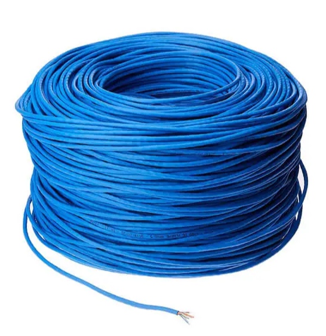</td>
</tr>
<tr>
<td style="text-align: center;">Figura 10 - Cabo UTP - Par trançado não blindado.</td>
</tr>
</tbody>
</table>

**Sequência de Passos**

   * **Preparação dos Fios:**
        Decape cerca de 2-3 cm da capa externa do cabo usando uma ferramenta de decapagem ou um estilete. Certifique-se de não danificar os fios internos.
        Organize os pares de fios na ordem correta. A ordem geralmente é T568B ou T568A, dependendo da configuração da rede. Certifique-se de usar a mesma ordem nos dois lados do cabo (conector RJ-45).
   * **Corte os Fios Excedentes (Opcional):**
        Se os fios internos estiverem muito compridos, você pode cortar o excesso com uma ferramenta de corte para que fiquem aproximadamente alinhados com a parte traseira do conector RJ-45.
   * **Inserção dos Fios no Conector:**
       Insira os fios na ordem correta nos pinos do conector RJ-45. Certifique-se de que os fios estejam bem encaixados nos pinos.
   * **Crimpagem:**
        Insira o conector RJ-45 com os fios no alicate de crimpagem RJ-45. Aperte o alicate com firmeza e certifique-se de que ele esteja completamente fechado. Isso fará com que os contatos metálicos no conector pressionem os fios com força, criando uma conexão sólida.
   * **Verificação:**
        Após a crimpagem, verifique visualmente se os fios estão corretamente alinhados e conectados aos pinos. Use um verificador de cabo ou um testador de cabo para verificar se a conexão está funcionando corretamente. Isso é especialmente importante para garantir que não haja fios cruzados ou mal conectados.
   * **Repetição do Processo:**
        Repita o mesmo processo no outro lado do cabo, garantindo que a ordem dos fios seja a mesma que você usou no primeiro conector RJ-45.

Lembrando que a ordem dos fios (T568B ou T568A) deve ser consistente em ambos os conectores RJ-45 para que o cabo funcione corretamente em sua rede Ethernet. Além disso, use cabos de boa qualidade e certifique-se de que as ferramentas estejam em boas condições para obter resultados confiáveis.

<table border="0">
<tbody>
<tr>
<td style="width: 50%;">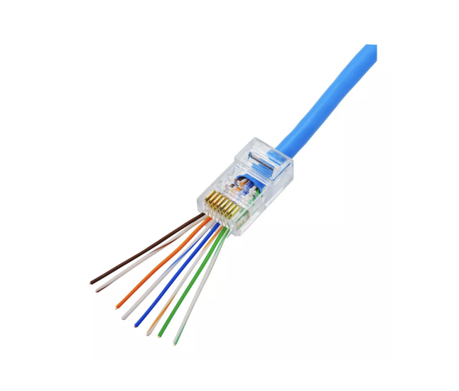</td>
</tr>
<tr>
<td style="text-align: center;">Figura 11 - Ordem dos fios padrão T568B no conector RJ-45.</td>
</tr>
</tbody>
</table>

Dois padrões de T568A e T568B podem ser usados ​​para conectar cabos Ethernet Cat5e e Cat6. A única diferença entre o T568A e o T568B é que as posições dos fios da faixa verde / verde e laranja / laranja são trocadas.

<table border="0">
<tbody>
<tr>
<td style="width: 50%;">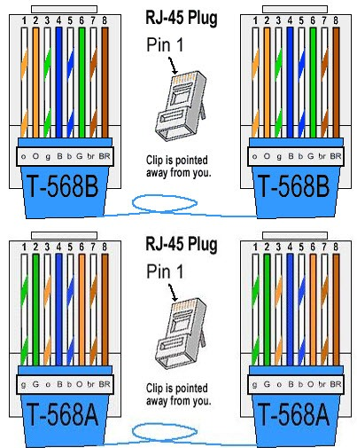</td>
</tr>
<tr>
<td style="text-align: center;">Figura 12 - Ordem dos fios padrão T568B e T568A .</td>
</tr>
</tbody>
</table>

## 2- Testar o funcionamento dos cabos/conectores RJ-45

O testador eletrônico de cabeamento de redes de computador e telefonia é uma ferramenta de medição que visa o bom funcionamento do cabo de acordo com as especificações técnicas em rede de computadores e redes telefônicas. Para executar o teste, conecte os cabos no testador principal e no testador remoto. Ligue a chave de alimentação. As luzes dos dois testadores ligam indicando quais circuitos estão ativos.

<table border="0">
<tbody>
<tr>
<td style="width: 60%;">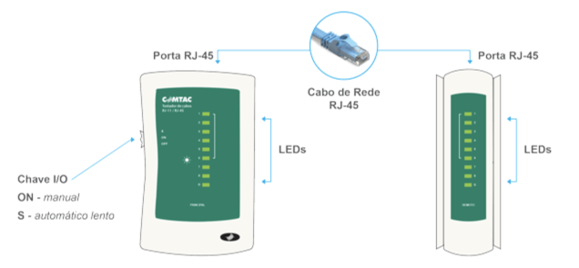</td>
</tr>
<tr>
<td style="text-align: center;">Figura 13 - Testador de Cabos RJ-45 / RJ-11.</td>
</tr>
</tbody>
</table>

## 3- Aparelhos telefonicos IP Khomp IPS 300

https://www.khomp.com/wp-content/uploads/2016/07/datasheet_IPS-300-PT-V1.pdf 

<table border="0">
<tbody>
<tr>
<td style="width: 70%;">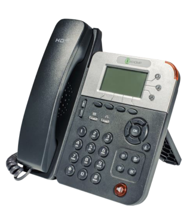</td>
</tr>
<tr>
<td style="text-align: center;">Figura 14 - Telefone IP Khomp IPS 300.</td>
</tr>
</tbody>
</table>

<table cellspacing="0" class="MsoTableGrid" style="border-collapse:collapse; border:none; margin-left:48px">
	<tbody>
		<tr>
			<td style="border-bottom:1px solid black; border-left:1px solid black; border-right:1px solid black; border-top:1px solid black; height:15px; vertical-align:top; width:566px">
			
<strong>Modelo IPS 300 - Caracter&iacute;sticas</strong>

			</td>
		</tr>
		<tr>
			<td style="border-bottom:1px solid black; border-left:1px solid black; border-right:1px solid black; border-top:none; vertical-align:top; width:566px">
			
3 linhas LCD de 128 x 64 pixels

			</td>
		</tr>
		<tr>
			<td style="border-bottom:1px solid black; border-left:1px solid black; border-right:1px solid black; border-top:none; vertical-align:top; width:566px">
			
Conex&atilde;o Gigabit Ethernet HD Voice Suporte a PoE (Power Over Ethernet)

			</td>
		</tr>
		<tr>
			<td style="border-bottom:1px solid black; border-left:1px solid black; border-right:1px solid black; border-top:none; vertical-align:top; width:566px">
			
Abrange a exclusiva tecnologia de processamento de voz que permite chamadas de voz mais realistas e claras e comunica&ccedil;&atilde;o mais fluente

			</td>
		</tr>
		<tr>
			<td style="border-bottom:1px solid black; border-left:1px solid black; border-right:1px solid black; border-top:none; vertical-align:top; width:566px">
			
Avan&ccedil;ado processamento de chamadas

			</td>
		</tr>
		<tr>
			<td style="border-bottom:1px solid black; border-left:1px solid black; border-right:1px solid black; border-top:none; vertical-align:top; width:566px">
			
Suporta um circuito de 2 linhas com luz indicadora de 2 cores, para auxiliar no gerenciamento de linhas simult&acirc;neas e fila de chamadas Indicado para teleconfer&ecirc;ncia e transfer&ecirc;ncia de chamadas Suporte a liga&ccedil;&otilde;es peer-to-peer

			</td>
		</tr>
		<tr>
			<td style="border-bottom:1px solid black; border-left:1px solid black; border-right:1px solid black; border-top:none; vertical-align:top; width:566px">
			
Lista de Contatos

			</td>
		</tr>
		<tr>
			<td style="border-bottom:1px solid black; border-left:1px solid black; border-right:1px solid black; border-top:none; vertical-align:top; width:566px">
			
Suporte a contatos comerciais. Cat&aacute;logo telef&ocirc;nico particular facilitando a busca por n&uacute;mero da chamada.

			</td>
		</tr>
		<tr>
			<td style="border-bottom:1px solid black; border-left:1px solid black; border-right:1px solid black; border-top:none; vertical-align:top; width:566px">
			
Tela

			</td>
		</tr>
		<tr>
			<td style="border-bottom:1px solid black; border-left:1px solid black; border-right:1px solid black; border-top:none; vertical-align:top; width:566px">
			
Display LCD gr&aacute;fico de 128 X 64 pixels Tamanho da tela: 6 x 3 cm

			</td>
		</tr>
		<tr>
			<td style="border-bottom:1px solid black; border-left:1px solid black; border-right:1px solid black; border-top:none; vertical-align:top; width:566px">
			
Idioma

			</td>
		</tr>
		<tr>
			<td style="border-bottom:1px solid black; border-left:1px solid black; border-right:1px solid black; border-top:none; vertical-align:top; width:566px">
			
Portugu&ecirc;s, espanhol, ingl&ecirc;s e outros

			</td>
		</tr>
		<tr>
			<td style="border-bottom:1px solid black; border-left:1px solid black; border-right:1px solid black; border-top:none; vertical-align:top; width:566px">
			
Teclado de fun&ccedil;&otilde;es

			</td>
		</tr>
		<tr>
			<td style="border-bottom:1px solid black; border-left:1px solid black; border-right:1px solid black; border-top:none; vertical-align:top; width:566px">
			
4 teclas program&aacute;veis (via software) 3 teclas de linha 6 teclas de navega&ccedil;&atilde;o (bot&atilde;o de seta, bot&atilde;o OK, bot&atilde;o C) Ajuste de volume, viva-voz, interrup&ccedil;&atilde;o de som (mudo), fone de ouvido, caixa de mensagens, reten&ccedil;&atilde;o (hold), rediscagem, confer&ecirc;ncia e transfer&ecirc;ncia.

			</td>
		</tr>
		<tr>
			<td style="border-bottom:1px solid black; border-left:1px solid black; border-right:1px solid black; border-top:none; vertical-align:top; width:566px">
			
Protocolos de Comunica&ccedil;&atilde;o

			</td>
		</tr>
		<tr>
			<td style="border-bottom:1px solid black; border-left:1px solid black; border-right:1px solid black; border-top:none; vertical-align:top; width:566px">
			
VoIP: Protocolo SIP 2.0 Protocolo de rede: HTTP, BOOTP, FTP, TFTP, IEEE 802.1Q Qualidade do Servi&ccedil;o: TOS, Jiffer Buffer, VAD, CNG, G.168 (32ms)

			</td>
		</tr>
		<tr>
			<td style="border-bottom:1px solid black; border-left:1px solid black; border-right:1px solid black; border-top:none; vertical-align:top; width:566px">
			
Decodifica&ccedil;&atilde;o de voz

			</td>
		</tr>
		<tr>
			<td style="border-bottom:1px solid black; border-left:1px solid black; border-right:1px solid black; border-top:none; vertical-align:top; width:566px">
			
Codecs: G.723.1, G.729 A/B, G.711 A/U, G.722

			</td>
		</tr>
		<tr>
			<td style="border-bottom:1px solid black; border-left:1px solid black; border-right:1px solid black; border-top:none; vertical-align:top; width:566px">
			
Rede

			</td>
		</tr>
		<tr>
			<td style="border-bottom:1px solid black; border-left:1px solid black; border-right:1px solid black; border-top:none; vertical-align:top; width:566px">
			
2&times;RJ45 10/100/1000M Gigabit Ethernet Interfaces (LAN/PC) Atribui&ccedil;&atilde;o de IP: IP est&aacute;tico, DHCP, PPPoE Cliente DNS, VPN(L2TP), VLAN

			</td>
		</tr>
		<tr>
			<td style="border-bottom:1px solid black; border-left:1px solid black; border-right:1px solid black; border-top:none; vertical-align:top; width:566px">
			
Voz

			</td>
		</tr>
		<tr>
			<td style="border-bottom:1px solid black; border-left:1px solid black; border-right:1px solid black; border-top:none; vertical-align:top; width:566px">
			
Voz HD: HD Codec/Handset/Speaker(Full-duplex) Dispon&iacute;vel o modo de al&ccedil;a, fone de ouvido e viva-voz Suporta fones de ouvido PS2 ou RJ9(4P4C) Ajuste separado de volume de 9 n&iacute;veis

			</td>
		</tr>
		<tr>
			<td style="border-bottom:1px solid black; border-left:1px solid black; border-right:1px solid black; border-top:none; vertical-align:top; width:566px">
			
Processamento de chamadas

			</td>
		</tr>
		<tr>
			<td style="border-bottom:1px solid black; border-left:1px solid black; border-right:1px solid black; border-top:none; vertical-align:top; width:566px">
			
Indicador de status das linhas Sempre encaminhar, encaminhamento ocupado, encaminhamento sem resposta Linha direta (imediatamente/atraso) Chamada em espera, fila de chamadas, comuta&ccedil;&atilde;o de linha Encaminhamento de chamada, transfer&ecirc;ncia de chamada, reten&ccedil;&atilde;o de chamada, aten&ccedil;&atilde;o de chamada, retorno de chamada Discagem de uma tecla, rediscagem Discagem r&aacute;pida diretamente do telefone, discagem direta do registro de chamadas Confer&ecirc;ncia de 3 vias, SIP MESSAGE (Instant Message) DnD, Lista negra Correio de voz, prompt de voz, mensagens de voz BLF, BLA, discagem r&aacute;pida

			</td>
		</tr>
		<tr>
			<td style="border-bottom:1px solid black; border-left:1px solid black; border-right:1px solid black; border-top:none; vertical-align:top; width:566px">
			
Aplicativos

			</td>
		</tr>
		<tr>
			<td style="border-bottom:1px solid black; border-left:1px solid black; border-right:1px solid black; border-top:none; vertical-align:top; width:566px">
			
Cat&aacute;logo telef&ocirc;nico p&uacute;blico, particular e em XML. Suporte para parede ajust&aacute;vel.

			</td>
		</tr>
		<tr>
			<td style="border-bottom:1px solid black; border-left:1px solid black; border-right:1px solid black; border-top:none; vertical-align:top; width:566px">
			
Seguran&ccedil;a

			</td>
		</tr>
		<tr>
			<td style="border-bottom:1px solid black; border-left:1px solid black; border-right:1px solid black; border-top:none; vertical-align:top; width:566px">
			
Login no LCD e no site mediante senha. Codifica&ccedil;&atilde;o da sinaliza&ccedil;&atilde;o e de m&iacute;dias.

			</td>
		</tr>
		<tr>
			<td style="border-bottom:1px solid black; border-left:1px solid black; border-right:1px solid black; border-top:none; vertical-align:top; width:566px">
			
Gerenciamento

			</td>
		</tr>
		<tr>
			<td style="border-bottom:1px solid black; border-left:1px solid black; border-right:1px solid black; border-top:none; vertical-align:top; width:566px">
			
Atualiza&ccedil;&atilde;o: HTTP/TFTP/FTP Auto-provis&atilde;o/TR069 Configura&ccedil;&otilde;es: Telefone/Web/ Auto-provis&atilde;o/TR069 Depura&ccedil;&atilde;o: Telnet/Telefone/Web

			</td>
		</tr>
		<tr>
			<td style="border-bottom:1px solid black; border-left:1px solid black; border-right:1px solid black; border-top:none; vertical-align:top; width:566px">
			
Alimenta&ccedil;&atilde;o

			</td>
		</tr>
		<tr>
			<td style="border-bottom:1px solid black; border-left:1px solid black; border-right:1px solid black; border-top:none; vertical-align:top; width:566px">
			
Adaptador de energia: entrada CA100~240V e sa&iacute;da CC 5V/1A PoE (IEEE 802.af)

			</td>
		</tr>
		<tr>
			<td style="border-bottom:1px solid black; border-left:1px solid black; border-right:1px solid black; border-top:none; vertical-align:top; width:566px">
			
Especifica&ccedil;&otilde;es

			</td>
		</tr>
		<tr>
			<td style="border-bottom:1px solid black; border-left:1px solid black; border-right:1px solid black; border-top:none; vertical-align:top; width:566px">
			
Temperatura de armazenamento: 0&ordm;C ~ 60&ordm;C Umidade na opera&ccedil;&atilde;o: 10%~90% Tamanho: 191 x 205 x 51 mm Peso l&iacute;quido: 800g

			</td>
		</tr>
		<tr>
			<td style="border-bottom:1px solid black; border-left:1px solid black; border-right:1px solid black; border-top:none; vertical-align:top; width:566px">
			
Certifica&ccedil;&otilde;es

			</td>
		</tr>
		<tr>
			<td style="border-bottom:1px solid black; border-left:1px solid black; border-right:1px solid black; border-top:none; vertical-align:top; width:566px">
			
Certifica&ccedil;&atilde;o Anatel Ind&uacute;stria certificada ISO 9001:2008

			</td>
		</tr>
	</tbody>
</table>

   <table border="0">
<tbody>
<tr>
<td style="width: 50%;">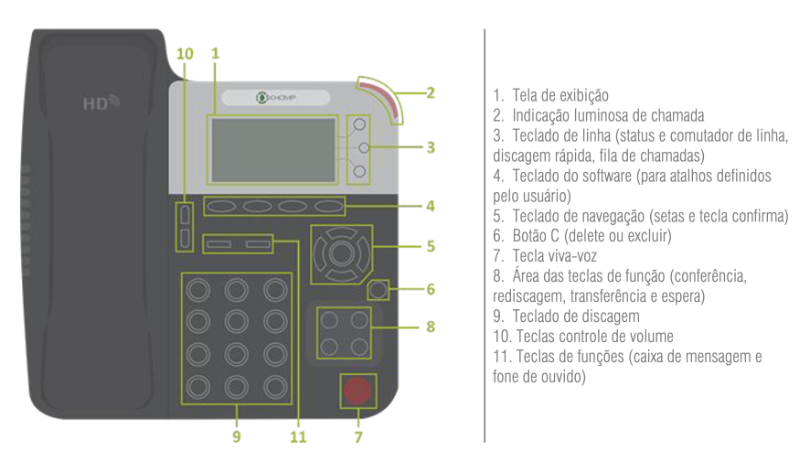</td>
</tr>
<tr>
<td style="text-align: center;">Figura 15 - Funcionalidades do telefone.</td>
</tr>
</tbody>
</table>

  
**Configuração do telefone IP Khomp IPS 300**

Para configurar os aparelhos IP precisaremos do seu IP,  usuário e senha. Veja como configurar Telefone IP 300 Khomp

1.Inicialmente restaurar configurações de fábrica:

* Ligar o telefone à energia e e rede de dados, pressionar a tecla Menu seguindo o procedimento:
 
     **menu/3.Config.Telefone/2. Configurações Avançadas/1. Avançado/6. Configuração de fábrica/ok**  e aguardar

* O telefone irá restaurar todas as configurações originais. Ele entrará com DHCP ativado e irá adquirir um IP da rede.

2.Configurar o Telefone no PBX Issabel:

* Pode-se configurar o aparelho telefônico pelo teclado do mesmo ou por uma interface web. 

**Sequência de passos à serem executados:**

* Configuarar o wifi do seu celular para a rede do laboratório (DEE-Prediais/prediais123)

* Abrir o nevegador e carregar o endereço do telefone 

      **(aparecerá na opção Menu/Ver Estado/IP:10.240.240.xx)**

* Aparecerá a imagem abaixo. Prencha com o usuário e senha. 

      **Usuário:** root
      
      **Senha:** root
 
<table border="0">
<tbody>
<tr>
<td style="width: 40%;">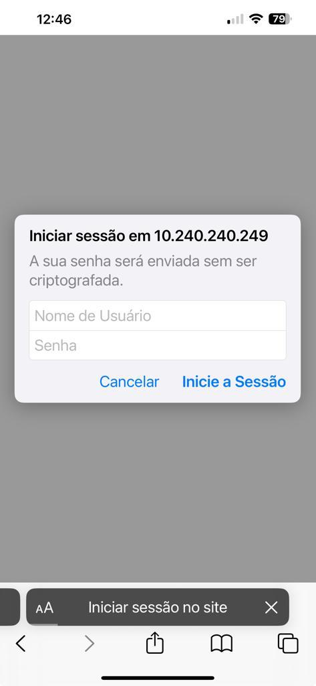</td>
</tr>
<tr>
<td style="text-align: center;">Figura 16 - Lela de login do telefone IP </td>
</tr>
</tbody>
</table>

* Aparecera a tela a seguir. Pressionando o menu **"Contas SIP"** , preencha como os dados abaixo e clicar no botão **"Atualizar"**.

<table border="0">
<tbody>
<tr>
<td style="width: 40%;">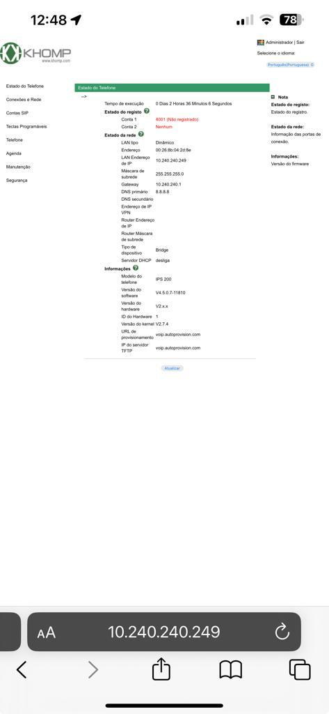</td>
</tr>
<tr>
<td style="text-align: center;">Figura 17 - Parâmetros de configuração dos telefones IP´s. </td>
</tr>
</tbody>
</table>

**Parâmetros de configuração dos telefones IP´s**

<table border="0">
<tbody>
<tr>
<td style="width: 50%;">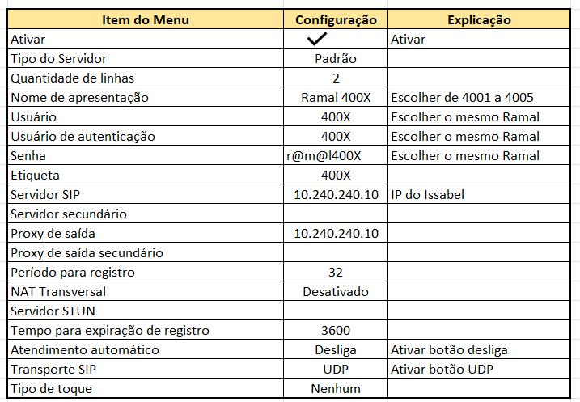</td>
</tr>
<tr>
<td style="text-align: center;">Figura 18 - Tabela de parâmetros de conta SIP dos telefones IP´s. </td>
</tr>
</tbody>
</table>

## 4- Softfone Zoiper no celular

Softphone é um software possível fazer chamadas telefônicas pela Internet. Os dispositivos mais comuns para uso do Softphone são: computador, notebook, tablet ou um smartphone, que permite ao usuário efetuar e receber chamadas sem precisar de um telefone convencional.

O softphone tem uma interface de uso fácil. Por meio da tela do dispositivo que escolher usar, você poderá ver uma representação gráfica de um telefone ou apenas de um teclado virtual.Usando o teclado, mouse, o touch screen de seu celular ou outro tipo de hardware, você consegue discar um número, armazenar contatos, atender ou desligar uma ligação, fazer transferência de chamadas e outras funções.

O softphone é composto por uma tela com teclado numérico semelhante ao do celular, onde o usuário realiza chamadas como faria em um dispositivo móvel. Além disso, o software geralmente inclui uma lista de contatos, identificador e histórico de chamadas e outros recursos. Para que a ligação tenha uma boa qualidade, é recomendado utilizar o softphone junto com um headset.

**Download do softfone:**

Vá ao site do zoiper e escolha a versão do software conforme seu sistema operacional e instale em seu celular. Após instalado abra o aplicativo.

[https://www.zoiper.com/en/voip-softphone/download/current ]()

<table border="0">
<tbody>
<tr>
<td style="width: 30%;">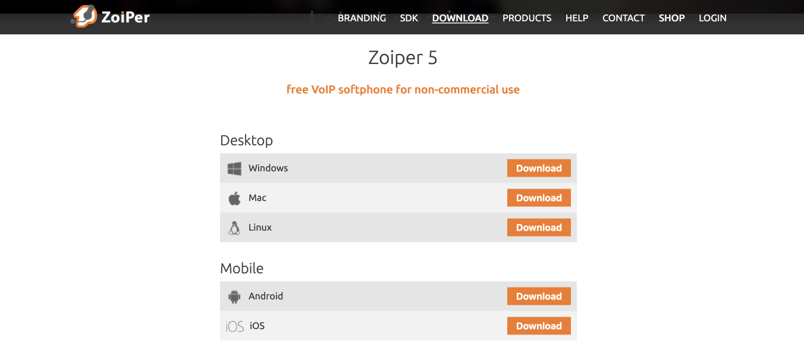</td>
</tr>
<tr>
<td style="text-align: center;">Figura 19 - Zoiper- Softfone free para uso não comercial.</td>
</tr>
</tbody>
</table>

* Tela inicial do app contendo o telado e barra de funções.
<table border="0">
<tbody>
<tr>
<td style="width: 30%;">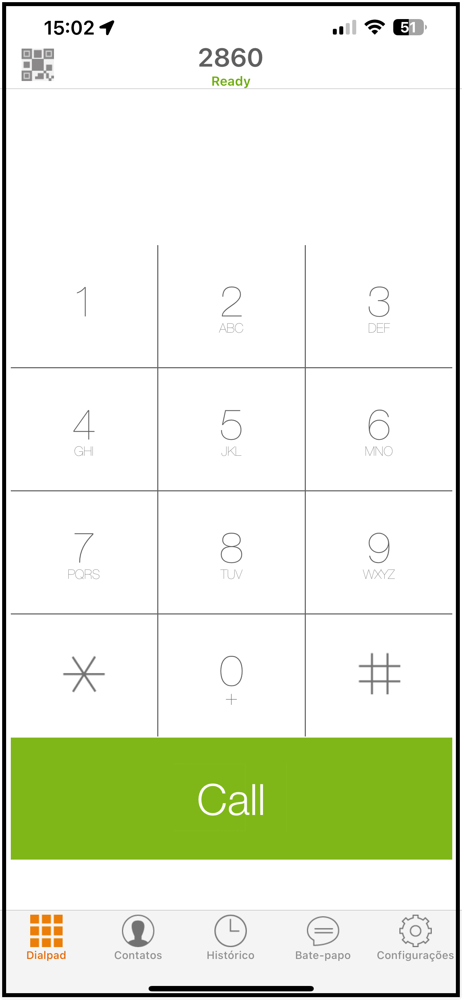</td>
</tr>
<tr>
<td style="text-align: center;">Figura 20 - Zoiper- Tela inicial.</td>
</tr>
</tbody>
</table>

* Pressione a engrenagem "Configurações"
<table border="0">
<tbody>
<tr>
<td style="width: 30%;">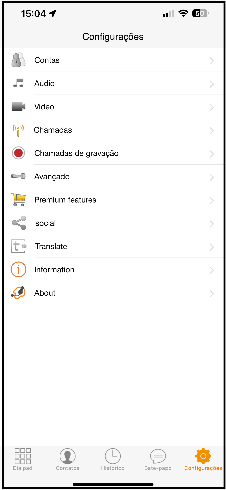</td>
</tr>
<tr>
<td style="text-align: center;">Figura 21 - Zoiper- Menu de configurações.</td>
</tr>
</tbody>
</table>

* Escolha o ítem do menu "Contas"
<table border="0">
<tbody>
<tr>
<td style="width: 30%;">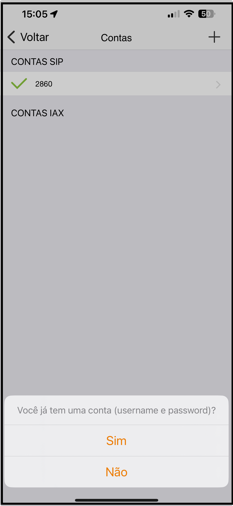</td>
</tr>
<tr>
<td style="text-align: center;">Figura 22 - Zoiper- Tela de criação de contas de usuários.</td>
</tr>
</tbody>
</table>

* Clicar no "+" no canto superior direito e a opção "SIM"para a pergunta "Você já tem uma conta?". posteriomente clicar no botão "Configuração Manual"
<table border="0">
<tbody>
<tr>
<td style="width: 30%;">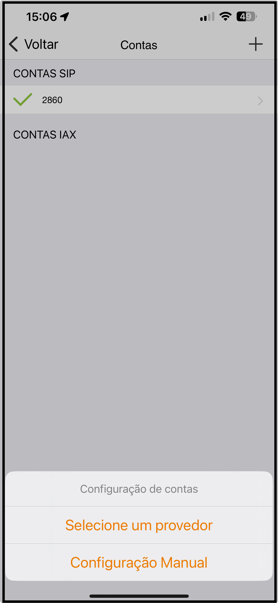</td>
</tr>
<tr>
<td style="text-align: center;">Figura 23 - Zoiper- Configuração manual da "Conta".</td>
</tr>
</tbody>
</table>

* Escolha o tipo de Conta SIP

<table border="0">
<tbody>
<tr>
<td style="width: 30%;">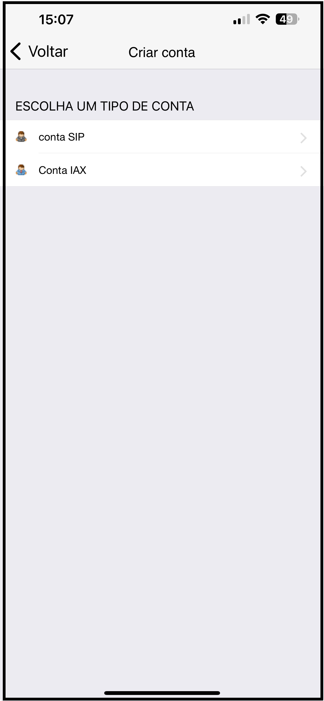</td>
</tr>
<tr>
<td style="text-align: center;">Figura 24 - Zoiper- Menu de tipos de "Contas".</td>
</tr>
</tbody>

* Configurações da Conta
  
</table>
<table border="0">
<tbody>
<tr>
<td style="width: 30%;">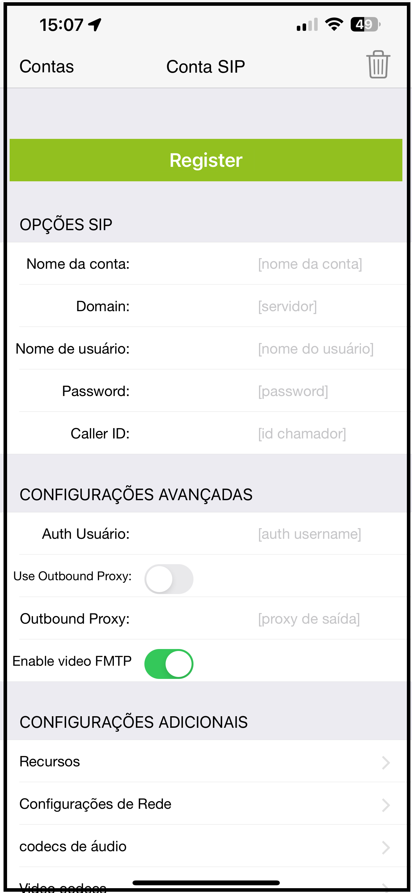</td>
</tr>
<tr>
<td style="text-align: center;">Figura 25 - Configurações da "Conta SIP".</td>
</tr>
</tbody>
</table>

Preencha os campos :

 * Nome da conta: 
 * Domain:
 * Nome do Usuário:
 * Password:
 * Caller ID: 

Mantenha os demais campos como estão. esta é a configuração básica para realizar e receber ligações VOIP.
Pressione o botão "Registrar". Caso as configurações estejam corretas irá aparecer a mensagem : "Status de registro OK". O Softfone estará pronto para uso.

## 5-Montagem dos cabos conexões dos equipamentos

Após a crimpagem dos conectores e testes de funcionamento dos mesmos, deve-se interligar os equipamentos conforme o diagrama abaixo:

</table>
<table border="0">
<tbody>
<tr>
<td style="width: 100%;">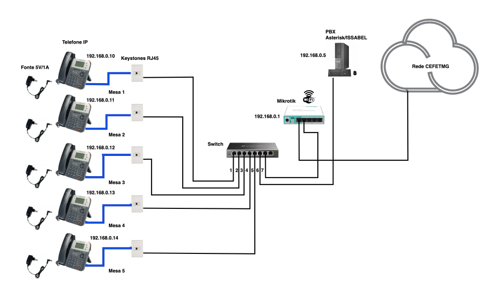</td>
</tr>
<tr>
<td style="text-align: center;">Figura 26 - Montagem dos equipamentos e cabeamento de rede.</td>
</tr>
</tbody>
</table>

## 6-Conexão dos celulares ao WI-FI do Laboratório

Uma vez instalado e configurado o app zoipper, troque a rede de WI-FI do celular para:

 * SSID :DEE-Prediais
 * Senha: prediais123

Abra o app zoipper e faça os testes de conexão.

## 7-Testes de funcionamento no PBX

1. Discar entre os colegas ramais de telefone ip 4001,4002,4003,4004 e 4005
1. Discar entre telefones fixos e ramais IP no celular (4010,4011,4012,4013,4014 e 4015)
1. Discar para um ramal e deixar tocar ( não atender). Logo em seguida ouvir a mensagem deixada na caixa postal.
1. Realizar uma conferencia de voz entre três ramais.
1. Redirecionar as chamadas de um ramal para outro ramal.

