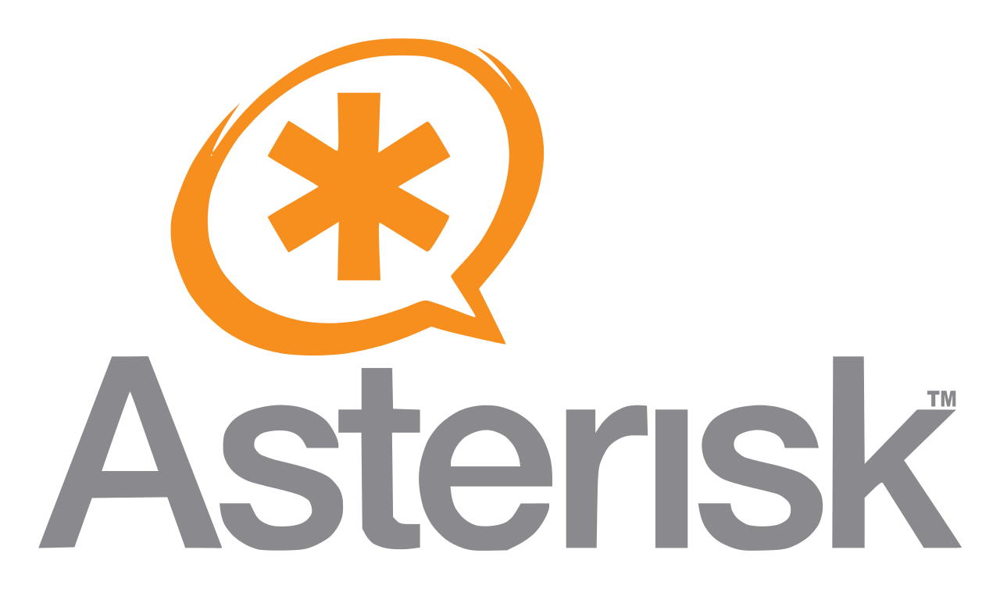

 # Este repositório está em desenvolvimento e portanto ainda incompleto.

## Aula prática de montagem e configuração de um PBX IP utilizando software de código livre e gratuito. 

## Departamento de Engenharia Elétrica do CEFET-MG campus NG  
## Coordenação do Curso Técnico de Eletrotécnica. 
## Laboratório de Instalações Elétricas Prediais - PLIEP

# Objetivos da aula

* Capacitar os alunos a desenvolver habilidades práticas na montagem de cabos UTP-CAT5 com conectores RJ-45 para estabelecer a rede Ethernet, viabilizando a interligação de equipamentos;
* Proporcionar conhecimentos para a configuração de telefones IP e softphones para celular, permitindo que os alunos adquiram competências valiosas no campo das comunicações VoIP (Voz sobre IP);
* Conhecer o básico da operação e das facilidades o SW livre Asterisk e a interface gráfica do pbxIP Issabel.
 
# O que é um sistema de telefone PBX?

O PBX, ou Private Branch Exchange, é um sistema de telecomunicações usado em empresas para facilitar a comunicação interna e externa. Tradicionalmente, as empresas empregavam telefones proprietários específicos para se conectar ao PBX, mas a evolução tecnológica levou à adoção predominante de sistemas IP-PBX, baseados em padrões abertos e compatíveis com a tecnologia de Voz sobre IP (VoIP).

Os sistemas PBX, são projetados para automatizar e simplificar o gerenciamento de chamadas telefônicas em ambientes corporativos. Isso inclui recursos como grupos de ramais para direcionar chamadas para vários telefones, filas para atendimento ordenando as chamadas, correio de voz para armazenar mensagens, gravações de ligações e muito mais.

PBXIP utiliza a automação e a tecnologia IP para otimizar a gestão das chamadas telefônicas em empresas, oferecendo recursos avançados para melhorar a eficiência nas comunicações internas e externas.

# O que é VOIP?

<table border="0">
<tbody>
<tr>
<td style="width: 50%;"></td>
</tr>
<tr>
<td style="text-align: center;">Figura 1 - VOIP-"Voz sobre Protocolo de Internet".</td>
</tr>
</tbody>
</table>
VoIP é a sigla para "Voz sobre Protocolo de Internet" (Voice over Internet Protocol, em inglês). Trata-se de uma tecnologia que permite a transmissão de voz e outros tipos de comunicação de áudio e vídeo pela Internet, em vez de usar circuitos telefônicos tradicionais. Em outras palavras, o VoIP permite fazer chamadas telefônicas e conduzir videoconferências usando a infraestrutura de rede da Internet.

A principal vantagem do VoIP é a economia de custos em comparação com as chamadas telefônicas tradicionais, pois utiliza a infraestrutura de Internet já existente. Além disso, o VoIP oferece recursos avançados, como encaminhamento de chamadas, correio de voz, conferências e a capacidade de integrar facilmente a comunicação com outros aplicativos e serviços online.

Para usar o VoIP, você precisa de um serviço VoIP, o WhatsApp por exemplo ou um dispositivo compatível, como um computador, smartphone, tablet ou telefone IP. A voz é convertida em pacotes de dados digitais e transmitida pela Internet para o destinatário, onde é convertida de volta em áudio. Essa tecnologia tornou-se amplamente popular para chamadas de longa distância, videoconferências, chamadas internacionais e comunicações pessoais ou empresariais devido à sua eficiência e custos reduzidos.

# O Asterisk
<table border="0">
<tbody>
<tr>
<td style="width: 50%;"></td>
</tr>
<tr>
<td style="text-align: center;">Figura 2 - Software de PBX IP ASTERISK.</td>
</tr>
</tbody>
</table>
O Asterisk é um software de código aberto que desempenha um papel fundamental na implementação de sistemas de telecomunicações baseados em VoIP (Voz sobre Protocolo de Internet) e comunicações unificadas. Ele foi originalmente desenvolvido por Mark Spencer e lançado em 1999 como um projeto de código aberto. Desde então, tornou-se uma das plataformas mais populares e versáteis para a construção de sistemas de PBX e mensagens unificadas.

## Caracteristicas básicas do Asterisk:

   * Plataforma de Comunicações Aberta: O Asterisk é altamente flexível e personalizável, o que o torna adequado para uma ampla variedade de aplicações de telecomunicações. Ele pode ser usado para criar sistemas PBX (Private Branch Exchange), gateways VoIP, sistemas de conferência, correio de voz, IVR (Interactive Voice Response), entre outros.
   * Suporte a Protocolos: O Asterisk suporta uma variedade de protocolos de comunicação, incluindo SIP (Session Initiation Protocol), H.323, IAX (Inter-Asterisk eXchange), PSTN (Rede Telefônica Pública Comutada), e muitos outros. Isso permite a interoperabilidade com uma ampla gama de dispositivos e serviços de comunicação.
   * Recursos Avançados: Além de funções telefônicas básicas, o Asterisk oferece recursos avançados, como roteamento de chamadas, gravação de chamadas, encaminhamento de chamadas, videoconferência, detecção de fax, autenticação de chamadas, entre outros.
   * Comunidade Ativa: O Asterisk é mantido por uma comunidade de desenvolvedores ativos e tem uma grande base de usuários em todo o mundo. Isso significa que há suporte contínuo, atualizações regulares e uma variedade de módulos e extensões disponíveis.
   * Comunicações Unificadas: O Asterisk também pode ser integrado a outras soluções de comunicação, como e-mail, mensagens instantâneas e calendários, para criar sistemas de comunicações unificadas que consolidam diferentes canais de comunicação em uma única plataforma.

O Asterisk é amplamente utilizado por empresas de todos os tamanhos para implementar sistemas de telecomunicações personalizados e eficientes. Sua versatilidade, juntamente com sua natureza de código aberto, o torna uma escolha popular para muitos projetos de comunicação empresarial e VoIP.

# O ISSABEL

<table border="0">
<tbody>
<tr>
<td style="width: 50%;"></td>
</tr>
<tr>
<td style="text-align: center;">Figura 3 - Plataforma de Comunicação Issabel.</td>
</tr>
</tbody>
</table>

Issabel é uma plataforma de comunicações de voz e dados, de código aberto, baseada no software Asterisk. Ela fornece um conjunto abrangente de recursos para usuários que desejam implementar sistemas de telecomunicações avançados, como PBX (Private Branch Exchange), serviços de telefonia IP (VoIP) e comunicações unificadas. Issabel é conhecido por ser uma distribuição do Asterisk que facilita a configuração e a gestão de sistemas de comunicação.

## Características básicas do Issabel:

 * Baseado no Asterisk: Issabel usa o Asterisk como núcleo de comunicação. Ele inclui todas as capacidades do Asterisk, permitindo que as empresas configurem uma ampla gama de serviços de telefonia e comunicações.
 * Interface de Gerenciamento: Uma das características fundamentais do Issabel é sua interface de gerenciamento web amigável e de fácil utilização. Isso torna a configuração e a manutenção do sistema mais acessíveis para administradores de TI e usuários.
 * Recursos Avançados: O Issabel oferece recursos avançados, como roteamento de chamadas, correio de voz, videoconferência, IVR (Interactive Voice Response), relatórios detalhados, autenticação de chamadas e muito mais. Isso o torna uma solução completa para as necessidades de comunicação de uma empresa.
 * Comunicações Unificadas: Além das funcionalidades telefônicas tradicionais, o Issabel pode ser integrado a outras ferramentas de comunicação, como e-mail e mensagens instantâneas, para criar sistemas de comunicações unificadas que consolidam diferentes formas de comunicação.
 * Código Aberto: Assim como o Asterisk, o Issabel é uma solução de código aberto, o que significa que é possível personalizá-lo e adaptá-lo às necessidades específicas da empresa. Isso também contribui para a economia de custos, pois não requer a compra de licenças de software.

<table border="0">
<tbody>
<tr>
<td style="width: 50%;"></td>
</tr>
<tr>
<td style="text-align: center;">Figura xx - Dashboard do Issabel.</td>
</tr>
</tbody>
</table>

O Issabel é uma escolha popular para empresas que desejam implementar sistemas de comunicações avançados, especialmente aquelas que procuram uma solução baseada em Asterisk com uma interface de gerenciamento amigável. Ele oferece um conjunto de recursos abrangente e pode ser personalizado de acordo com as necessidades específicas de cada organização.

# Infraestrutura de Hardware do laboratório

O laboratório, fisicamente localizado na sala 203 do prédio 19 campus NG, possui os segintes equipamentos destinados a esta atividade:

* 01 servidor intel, com 4Gb de menória e 1 TB de disco rígido onde está instalado o sistema operacional Linux e a plataforma de sw Issabel;
* 05 telefones IP marca  Khomp IP300;
* 01 switch de 8 portas RJ45 de 10/100/1000 mbps;
* 01 roteador WIFI Mikrotik RB 433;
* 01 monitor de vídeo 14";
* 01 teclado;
* cabos UTP cat 5;
* conectores RJ45 e
* alicate  para crimpagem de conextores RJ45 e RJ11.

<table border="0">
<tbody>
<tr>
<td style="width: 50%;"></td>
</tr>
<tr>
<td style="text-align: center;">Figura 5 - Equipamentos utilizados na Prática de PBXIP .</td>
</tr>
</tbody>
</table>

<table border="0">
<tbody>
<tr>
<td style="width: 50%;"></td>
</tr>
<tr>
<td style="text-align: center;">Figura xx - Foto dos equipamentos  utilizados na Prática de PBXIP.</td>
</tr>
</tbody>
</table>

# Parte Prática

## Crimpar um conector RJ-45

É um processo importante para criar cabos de rede Ethernet. A crimpagem envolve a fixação dos fios dentro do conector de forma que eles estejam devidamente alinhados e conectados aos pinos internos.

## Materiais Necessários:
 * Cabo de rede (geralmente U/FTP, U/UTP, FTP ou STP, com 4 pares de fios)
 * Conectores RJ-45
 * Ferramenta de decapagem de cabos ou um estilete
 * Ferramenta de corte
 * Diagrama de pinagem (para garantir que os fios estejam na ordem correta)
 * Alicate para crimpagem de conectores RJ45

## Ferramentas necessárias

* Alicate de crimpar Multi função, corta fio para conectores de passagem EZ Crimp RJ45 RJ12 RJ11
<table border="0">
<tbody>
<tr>
<td style="width: 40%;"></td>
</tr>
<tr>
<td style="text-align: center;">Figura xx - Alicate para crimpagem de conectores RJ45.</td>
</tr>
</tbody>
</table>
 
* O RJ45 (Registered Jack 45) é um dos principais conectores utilizado nas placas de rede Ethernet.
  
<table border="0">
<tbody>
<tr>
<td style="width: 40%;"></td>
</tr>
<tr>
<td style="text-align: center;">Figura xx - Conectores RJ45.</td>
</tr>
</tbody>
</table>

* O cabo de rede cat5e foi desenvolvido para suportar velocidades de até 1.000 Mbps, reduzir a interferência da infraestrutura e minimizar a perda de sinal.
Essas melhorias possibilitaram o uso de cabos mais longos, quase próximos dos atuais 100 metros permitidos. Por isso, é indicado para instalações domésticas e corporativas.

<table border="0">
<tbody>
<tr>
<td style="width: 40%;"></td>
</tr>
<tr>
<td style="text-align: center;">Figura xx - Cabo UTP Cat5e.</td>
</tr>
</tbody>
</table>

## Sequencia de Passos

   * Preparação dos Fios:
        Decape cerca de 2-3 cm da capa externa do cabo usando uma ferramenta de decapagem ou um estilete. Certifique-se de não danificar os fios internos.
        Organize os pares de fios na ordem correta. A ordem geralmente é T568B ou T568A, dependendo da configuração da rede. Certifique-se de usar a mesma ordem nos dois lados do cabo (conector RJ-45).
   * Corte os Fios Excedentes (Opcional):
        Se os fios internos estiverem muito compridos, você pode cortar o excesso com uma ferramenta de corte para que fiquem aproximadamente alinhados com a parte traseira do conector RJ-45.
   * Inserção dos Fios no Conector:
       Insira os fios na ordem correta nos pinos do conector RJ-45. Certifique-se de que os fios estejam bem encaixados nos pinos.
   * Crimpagem:
        Insira o conector RJ-45 com os fios no alicate de crimpagem RJ-45.
        Aperte o alicate com firmeza e certifique-se de que ele esteja completamente fechado. Isso fará com que os contatos metálicos no conector pressionem os fios com força, criando uma conexão sólida.
   * Verificação:
        Após a crimpagem, verifique visualmente se os fios estão corretamente alinhados e conectados aos pinos.
        Use um verificador de cabo ou um testador de cabo para verificar se a conexão está funcionando corretamente. Isso é especialmente importante para garantir que não haja fios cruzados ou mal conectados.
    * Repetição do Processo:
        Repita o mesmo processo no outro lado do cabo, garantindo que a ordem dos fios seja a mesma que você usou no primeiro conector RJ-45.

Lembrando que a ordem dos fios (T568B ou T568A) deve ser consistente em ambos os conectores RJ-45 para que o cabo funcione corretamente em sua rede Ethernet. Além disso, use cabos de boa qualidade e certifique-se de que as ferramentas estejam em boas condições para obter resultados confiáveis.

<table border="0">
<tbody>
<tr>
<td style="width: 50%;"></td>
</tr>
<tr>
<td style="text-align: center;">Figura xx - Ordem dos fios padrão T568B no conector RJ-45.</td>
</tr>
</tbody>
</table>

Dois padrões de T568A e T568B podem ser usados ​​para conectar cabos Ethernet Cat5e e Cat6. A única diferença entre o T568A e o T568B é que as posições dos fios da faixa verde / verde e laranja / laranja são trocadas.

<table border="0">
<tbody>
<tr>
<td style="width: 50%;"></td>
</tr>
<tr>
<td style="text-align: center;">Figura 8 - Ordem dos fios padrão T568B e T568A .</td>
</tr>
</tbody>
</table>

## Conectar os cabos entre os telefones IP e o Switch

descrever as atividades

## Configurar os aparenhos telefonicos IP

descrever as atividades

## Softfone no celular

Softphone é um software possível fazer chamadas telefônicas pela Internet. Os dispositivos mais comuns para uso do Softphone são: computador, notebook, tablet ou um smartphone, que permite ao usuário efetuar e receber chamadas sem precisar de um telefone convencional.

O softphone tem uma interface de uso fácil. Por meio da tela do dispositivo que escolher usar, você poderá ver uma representação gráfica de um telefone ou apenas de um teclado virtual.Usando o teclado, mouse, o touch screen de seu celular ou outro tipo de hardware, você consegue discar um número, armazenar contatos, atender ou desligar uma ligação, fazer transferência de chamadas e outras funções.

O softphone é composto por uma tela com teclado numérico semelhante ao do celular, onde o usuário realiza chamadas como faria em um dispositivo móvel. Além disso, o software geralmente inclui uma lista de contatos, identificador e histórico de chamadas e outros recursos. Para que a ligação tenha uma boa qualidade, é recomendado utilizar o softphone junto com um headset.

## Download do Softfone:

Vá ao site do zoiper e escolha a versão do software conforme seu sistema operacional

https://www.zoiper.com/en/voip-softphone/download/current 

<table border="0">
<tbody>
<tr>
<td style="width: 10%;"></td>
</tr>
<tr>
<td style="text-align: center;">Figura xx - Zoiper- Softfone free para uso não comercial.</td>
</tr>
</tbody>
</table>

* sfdfdfdfdf

<table border="0">
<tbody>
<tr>
<td style="width: 10%;"></td>
</tr>
<tr>
<td style="text-align: center;">Figura xx - Zoiper- Softfone free para uso não comercial.</td>
</tr>
</tbody>
</table>

* sfdfdfdfdf

<table border="0">
<tbody>
<tr>
<td style="width: 10%;"></td>
</tr>
<tr>
<td style="text-align: center;">Figura xx - Zoiper- Softfone free para uso não comercial.</td>
</tr>
</tbody>
</table>

* sfdfdfdfdf

<table border="0">
<tbody>
<tr>
<td style="width: 10%;"></td>
</tr>
<tr>
<td style="text-align: center;">Figura xx - Zoiper- Softfone free para uso não comercial.</td>
</tr>
</tbody>
</table>

* sfdfdfdfdf

<table border="0">
<tbody>
<tr>
<td style="width: 10%;"></td>
</tr>
<tr>
<td style="text-align: center;">Figura xx - Zoiper- Softfone free para uso não comercial.</td>
</tr>
</tbody>
</table>

sfdfdfdfdf

<table border="0">
<tbody>
<tr>
<td style="width: 10%;"></td>
</tr>
<tr>
<td style="text-align: center;">Figura xx - Zoiper- Softfone free para uso não comercial.</td>
</tr>
</tbody>

 
* sfdfdfdfdf
   

</table>
<table border="0">
<tbody>
<tr>
<td style="width: 10%;"></td>
</tr>
<tr>
<td style="text-align: center;">Figura xx - Zoiper- Softfone free para uso não comercial.</td>
</tr>
</tbody>
</table>

## Realizar os testes do PBX

